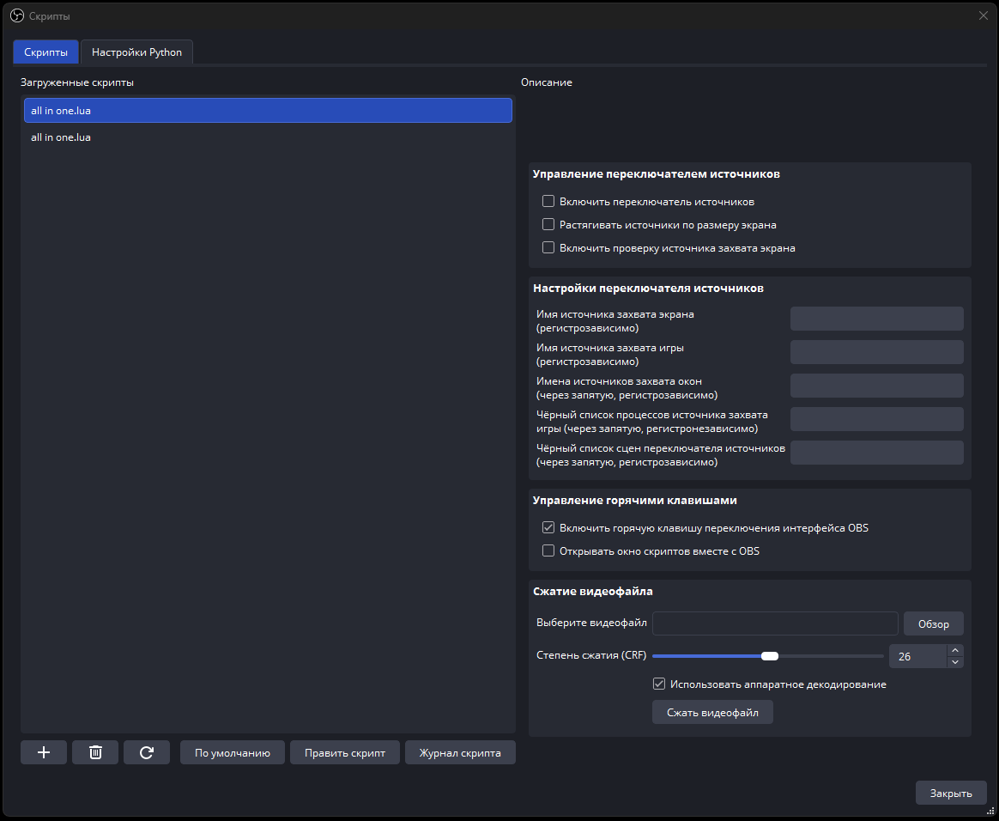

# OBS-Script
Многофункциональный Lua-скрипт для OBS. Имеет несколько основных фишек: переключатель источников, переключение видимости интерфейса OBS по горячей клавише, сжатие видеофайлов через внешний FFmpeg.
## Окно настроек скрипта по умолчанию

# Подробное описание функций скрипта
## Переключатель источников
Позволяет автоматизировать процесс переключения источников. 
Основная идея этой функции заключалась в минимизации потребления ресурсов ПК источником захвата дисплея путем его скрытия в моменты когда он не нужен.
Для начала работы этой функции нужно включить чекбокс "Включить переключатель источников" во вкладке "Управление переключателем источников" и заполнить некоторые поля ввода во вкладке "Настройки переключателя источников".
В зависимости от заполненных полей могут меняться режимы работы переключателя. Из основных режимов можно выделить несколько:
- Дисплей + Игра
- Дисплей + Игра + Окно (Окна)
- Игра + Окно (Окна)
- Дисплей + Окно (Окна)
- Окно (Окна)